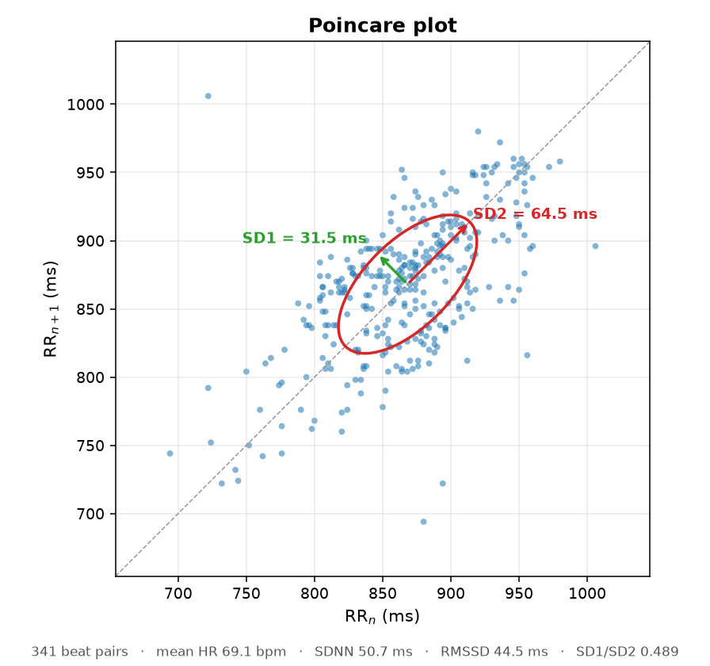

# ECG / HRV 量測與分析工具組

以 Arduino UNO R4 WiFi 搭配 AD8232 單導程心電模組，做即時心電訊號顯示、錄製，
以及心率變異度（HRV）分析與 PDF 報告產生。

## 分析輸出範例

<p align="center">
  
</p>

一段 5 分鐘靜息記錄的龐加萊圖。每個點代表一組相鄰的 RR 區間 `(RR_n, RR_n+1)`，
散布沿對角線拉長、垂直方向較窄，是正常竇性心律的典型形態。

紅色橢圓的兩個半軸即為兩項標準指標：**SD1** 是垂直於對角線的散布寬度，代表逐拍之間的
短期變異（與 RMSSD 等價）；**SD2** 是沿對角線方向的散布長度，代表長期變異。

重現方式：

```bash
python hrv_analysis.py --csv rec.csv --poincare docs/poincare.png
```

## 硬體

| 項目 | 內容 |
|---|---|
| 開發板 | Arduino UNO R4 WiFi（Renesas RA4M1） |
| 類比前端 | AD8232 單導程心電模組 |
| 取樣率 | 500 Hz（以 `micros()` 計時） |
| ADC | 14-bit（0–16383） |

接線：

| AD8232 | Arduino |
|---|---|
| OUTPUT | A0 |
| LO+ | D10 |
| LO- | D11 |
| 3.3V / GND | 3.3V / GND |

UNO R4 走原生 USB CDC，Windows 不需額外安裝 CH340／CP210x 驅動。

## 檔案

| 檔案 | 用途 |
|---|---|
| `ecg.ino` | 韌體。500 Hz 取樣，輸出 `ADC值,電極脫落` |
| `ecg_live.py` | 即時波形顯示、R 波標記、即時心率、CSV 錄製 |
| `hrv_analysis.py` | HRV 指標計算與四格分析圖 |
| `hrv_report.py` | 產生中文 PDF 報告（四頁完整版／單頁摘要） |

## 韌體輸出格式

開機送出 banner：

```
#ECG fs=500 bits=14
```

之後每個樣本一行：

```
8213,0
```

第一欄為 14-bit ADC 值，第二欄為電極脫落旗標（LO+ 或 LO- 任一為 HIGH 即為 1）。

## 安裝

```bash
pip install pyserial numpy scipy matplotlib
```

韌體以 Arduino IDE 或 arduino-cli 上傳：

```bash
arduino-cli compile --fqbn arduino:renesas_uno:unor4wifi .
arduino-cli upload -p COM4 --fqbn arduino:renesas_uno:unor4wifi .
```

## 使用

即時顯示：

```bash
python ecg_live.py                              # 自動選埠
python ecg_live.py --list                       # 列出序列埠
python ecg_live.py --csv rec.csv --duration 300 # 錄 5 分鐘後自動關閉
python ecg_live.py --notch 50                   # 50 Hz 市電地區
```

HRV 分析：

```bash
python hrv_analysis.py --record 300 --csv rec.csv   # 錄製後直接分析
python hrv_analysis.py --csv rec.csv                # 分析既有檔案
python hrv_analysis.py --csv rec.csv --poincare p.png  # 另外輸出單張龐加萊圖
```

PDF 報告：

```bash
python hrv_report.py --csv rec.csv            # 四頁完整版
python hrv_report.py --csv rec.csv --simple   # 單頁摘要
```

## CSV 格式

| 欄位 | 說明 |
|---|---|
| `sample` | 流水號，從 0 開始 |
| `adc` | 原始 14-bit ADC 值 |
| `filtered` | 濾波後的值 |
| `lead_off` | 電極脫落狀態，0 或 1 |

## 訊號處理

1. **濾波**：0.5 Hz 二階高通（基線漂移）→ 60 Hz 陷波 Q=30（市電）→ 40 Hz 四階低通（肌電）。
   三級皆為因果性 IIR 並保留濾波器狀態，因此分塊即時處理與整段離線處理結果一致。
   刻意不使用 `filtfilt`：它需要訊號的未來，即時串流不存在。
2. **R 波偵測**：簡化版 Pan-Tompkins（微分 → 平方 → 120 ms 移動視窗積分 → 自適應門檻），
   250 ms 不應期，觸發後回溯 200 ms 取真正極值作為 R 波位置。
3. **異常區間剔除**：先排除 300–2000 ms 以外的非生理區間，再以前後各 10 拍中「已接受」
   區間的中位數為基準剔除偏離超過 20% 者，並迭代收斂。
4. **指標**：時域（SDNN、RMSSD、pNN50）、龐加萊（SD1、SD2、SD1/SD2）、
   頻域（VLF／LF／HF、LF/HF，以三次樣條內插至 4 Hz 後用 Welch 法估計）。

## 實作上的幾個坑

- **序列埠緩衝區**：500 Hz × 約 8 bytes ≈ 4 KB/s，而 Windows 序列埠緩衝區約 4 KB，
  1 秒就滿。接收端必須持續清空緩衝區，「睡一段時間再一次讀取」的寫法會掉資料。
- **自動選埠要靠 VID/PID**：UNO R4 在 Windows 通用 CDC 驅動下顯示為「USB 序列裝置」，
  描述字串裡沒有 `Arduino`。改以 VID `0x2341` 判斷；藍牙虛擬序列埠沒有 VID，可藉此排除。
- **異常剔除的視窗不能太窄**：若只比較前後 2 拍，一次雜訊爆發產生的數個連續假心搏
  會污染中位數本身，使錯誤區間互相背書而全部通過。
- **中文 PDF**：matplotlib 缺字時不會報錯，只會畫成空方框。需明確指定中文字型
  （Windows 上為微軟正黑體），並設 `pdf.fonttype = 42` 讓 TrueType 真正嵌入，
  文字才可搜尋複製。

## 限制

本系統為單導程業餘等級量測，適用於方法驗證、教學與同一受測者在相同條件下的前後比較，
**不具臨床診斷意義**。

HRV 數值受呼吸速率、姿勢、說話與情緒顯著影響，尤其 HF 成分幾乎等同於呼吸調節；
跨次比較務必固定量測條件。5 分鐘記錄不足以穩定估計 VLF 成分，不建議引用該頻帶數值。
